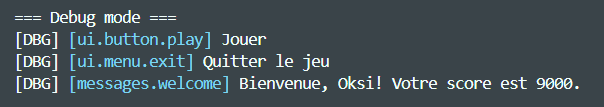

# 🗣️ Localizer  
**Header-only, JSON-driven localization library for modern C++**

> A lightweight and expressive **C++17 header-only library** for handling  
> **JSON-based localization files** — thread-safe, reloadable at runtime,  
> and fully customizable through user-defined callbacks.

---

## 📑 Table of Contents
- [Key Features](#-key-features)
- [Installation](#-installation)
- [Quick Start](#-quick-start)
- [Example JSON](#-example-json-configuration)
- [Configuration Macros](#-configuration-via-define-macros)
- [Custom Error Callback](#-custom-error-callback-example)
- [Changing Locale](#-changing-locale-at-runtime)
- [Debug Mode](#-debug-mode)
- [Stats Example](#-stats-example)
- [License](#-license)

---

## ✨ Key Features

- 🧩 **Header-only** — just drop in `Localizer.h`
- 📄 **JSON-based translations** (powered by [`nlohmann::json`](https://github.com/nlohmann/json))
- ⚙️ **Thread-safe** design with shared mutex locking
- 🔄 **Live reload** via file timestamp detection
- 🧠 **Customizable error callbacks** or built-in ANSI-color logger
- 🪶 **Lightweight** — zero dependencies beyond `<nlohmann/json.hpp>`
- 🎨 **Debug mode** with key highlighting and colorized console output

---

## 🧩 Installation

1. **Add the headers to your project:**
   ```
   /include/LocalizeController.h
   /include/json.hpp              // nlohmann::json
   ```

2. **Include it in your code:**
   ```cpp
   #include <LocalizeController.h>
   ```

3. *(Optional)* Add include paths in CMake or your IDE:
   ```cmake
   target_include_directories(MyApp PRIVATE include)
   target_compile_features(MyApp PRIVATE cxx_std_17)
   ```

---

## ⚡ Quick Start

```cpp
#include <iostream>
#include "LocalizeController.h"

int main() {
    // Load all JSON localization files from a folder
    Localizer::loadFromDirectory("langs");

    // Set the active locale
    Localizer::setLocale("en");

    // Simple translation
    std::cout << L("ui.button.play") << std::endl;

    // Placeholder example
    LocalizedString greet("ui.greeting", {{"user", "Oksi"}});
    std::cout << greet << std::endl;
}
```

**Output:**
```
Play
Hello, Oksi!
```

---

## 📄 Example JSON Configuration

```json
{
  "en": {
    "ui": {
      "button": {
        "play": "Play",
        "exit": "Exit"
      },
      "greeting": "Hello, {user}!"
    }
  },
  "ru": {
    "ui": {
      "button": {
        "play": "Играть",
        "exit": "Выход"
      },
      "greeting": "Привет, {user}!"
    }
  }
}
```

**Directory structure:**
```
langs/
 ├─ ui.json
 ├─ errors.json
 └─ gameplay.json
```

Each file is treated as a namespace.  
For example, `ui.json` → keys like `ui.button.play`, `ui.greeting`.

---

## 🛠️ Configuration via #define Macros

| Macro                     | Default      | Description                                         |
| ------------------------- | ------------ | --------------------------------------------------- |
| `LOC_THREAD_SAFE`         | `1`          | Enables thread-safety using `shared_mutex`          |
| `LOC_USE_REGEX`           | `0`          | Enables regex placeholder parsing                   |
| `LOC_CERR`                | `0`          | `1` — log errors to `std::cerr`, `0` — use callback |
| `LOC_DEFAULT_LOCALE`      | `"en"`       | Fallback locale                                     |
| `LOC_NAMESPACE_SEPARATOR` | `"."`        | Separator for nested JSON keys                      |
| `LOC_COLOR_DEFAULT`       | `"\x1b[32m"` | ANSI color for debug                                |
| `LOC_COLOR_RESET`         | `"\x1b[0m"`  | ANSI reset color code                               |

**Example:**
```cpp
#define LOC_CERR 0
#define LOC_THREAD_SAFE 1
#define LOC_USE_REGEX 0

#include "LocalizeController.h"
```

---

## 🚨 Custom Error Callback Example

By default, `Localizer` prints errors to `std::cerr` in red.  
If you want full control — attach your **custom error callback**.

> ⚠️ **Important:**  
> The callback **must be set before** calling `Localizer::loadFromDirectory()` or any other function that may produce errors.

```cpp
#define LOC_CERR 0
#include "LocalizeController.h"

void onError(const std::string& msg, int code) {
    std::cout << "\x1b[31m[Error " << code << "] " << msg << "\x1b[0m\n";
}

int main() {
    // Attach callback BEFORE loading any JSON files
    Localizer::setErrorCallback(onError);

    // Then safely load translations
    Localizer::loadFromDirectory("langs");
}
```

**Output:**
```
[Error 0] Cannot open language file: langs/missing.json
```

---

## 🌍 Changing Locale at Runtime

You can freely switch between languages during runtime —  
but keep in mind how **stored variables behave**.

> ⚠️ **Important:**  
> If you save a localized string (e.g., `LocalizedString`) while one locale is active,  
> and then change the locale — that saved object will still display the **old translation**.  
> To get the updated language, you must recreate or retranslate it.

```cpp
// Set locale to Russian
Localizer::setLocale("ru");
LocalizedString exitBtn("ui.button.exit");
std::cout << exitBtn << std::endl; // -> "Выход"

// Change to English later
Localizer::setLocale("en");

// Still shows the OLD translation because the string was stored earlier
std::cout << exitBtn << std::endl; // -> "Выход"

// To get updated text, recreate it:
LocalizedString updated("ui.button.exit");
std::cout << updated << std::endl; // -> "Exit"
```

🧠 **Explanation:**  
`LocalizedString` stores the resolved value at creation time.  
Changing the locale after that does **not** retroactively update previously created instances.

---

## 🎨 Debug Mode

`Debug mode` helps visualize which keys are being accessed and what translations are returned.  
It’s especially useful during development or when testing new localization files.

```cpp
// Example parameters for placeholders
std::unordered_map<std::string, std::string> params = {
    {"username", "Oksi"},
    {"score", "9000"}
};

// Enable debug mode
DebugOptions opts;
opts.enabled = true;
opts.coloredOutput = true;
opts.keyColor = "\x1b[36m"; // cyan
opts.prefix = "[DBG] ";
Localizer::setDebugOptions(opts);

std::cout << "\n=== Debug mode ===\n";
std::cout << L("ui.button.play") << "\n";
std::cout << L("ui.menu.exit") << "\n";
std::cout << L("messages.welcome", params) << "\n";
```

**Output:**  


> 💡 **Note:**  
> You can toggle debug mode **at runtime** using:
> ```cpp
> Localizer::setDebugMode(true);  // Enable debug output
> Localizer::setDebugMode(false); // Disable debug output
> ```
> This is useful when you want to enable detailed localization logs only in specific parts of your program.

🧠 **Explanation:**  
When `DebugOptions.enabled` is true, each translation is prefixed with its key,  
optionally colorized and formatted according to the provided options.

---

## 📦 Stats Example

You can print a short summary of all loaded languages and their key counts.  
Useful for debugging or verifying that all localization files were successfully loaded.

```cpp
Localizer::printStats();
```

**Output:**
```
📦 Localizer loaded 2 languages:
  🌐 en -> 12 keys
  🌐 ru -> 12 keys
```

🧠 **Explanation:**  
`printStats()` shows how many language packs are currently active in memory and how many keys each one contains.  
This is a quick way to confirm whether your localization directory structure is parsed correctly.

---

## 📜 License
MIT © [0x1mer](https://github.com/0x1mer)  
Special thanks to [1args](https://github.com/1args) for motivation and inspiration.
